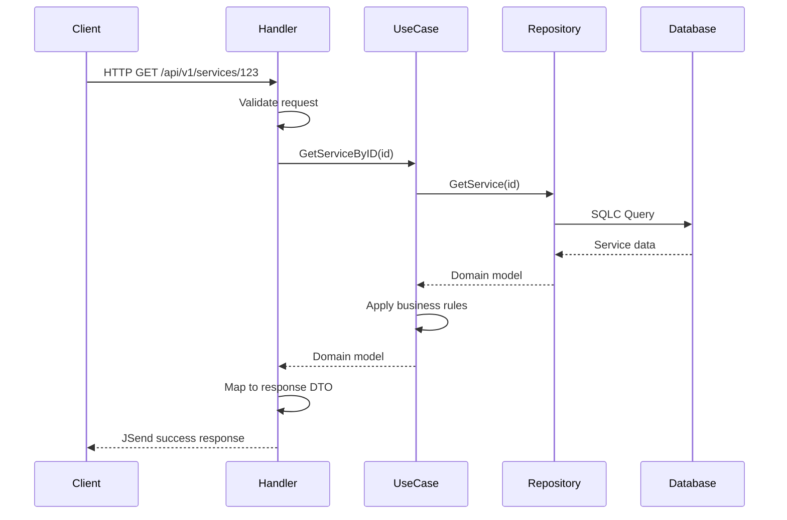
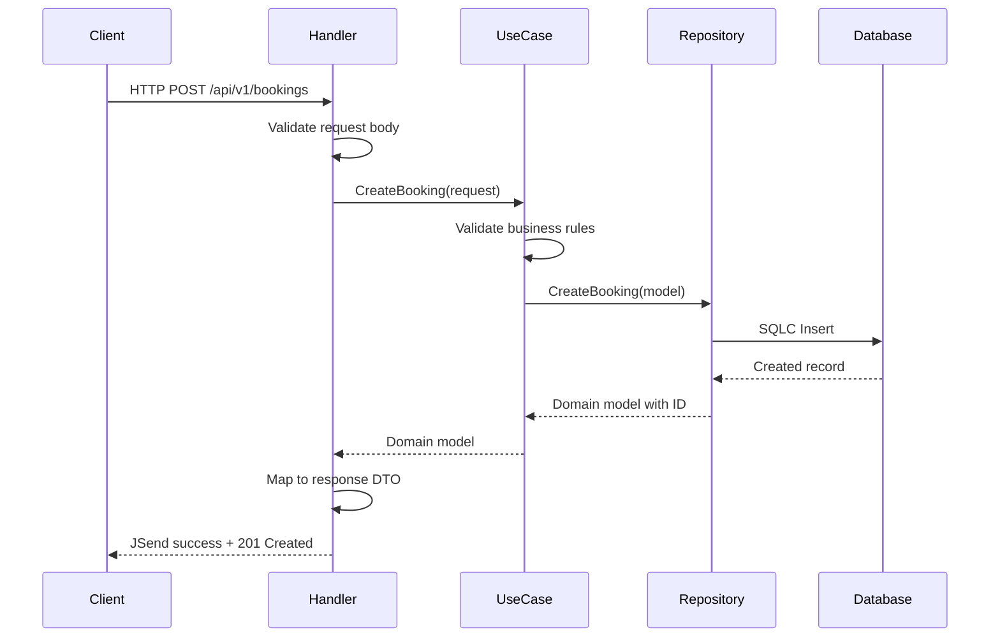

# Zercle Go Template - Architecture

## System Architecture

### High-Level Architecture

The application follows **Clean Architecture** principles with clear separation of concerns:

```
┌─────────────────────────────────────────────────────────────┐
│                         HTTP Layer                           │
│  (Echo Framework + Middleware + Request/Response)            │
└─────────────────────────────────────────────────────────────┘
                              │
                              ▼
┌─────────────────────────────────────────────────────────────┐
│                      Handler Layer                           │
│  (HTTP request handling, validation, response formatting)    │
└─────────────────────────────────────────────────────────────┘
                              │
                              ▼
┌─────────────────────────────────────────────────────────────┐
│                      UseCase Layer                           │
│  (Business logic, orchestration, domain rules)              │
└─────────────────────────────────────────────────────────────┘
                              │
                              ▼
┌─────────────────────────────────────────────────────────────┐
│                    Repository Layer                          │
│  (Data access abstraction, interface-based)                 │
└─────────────────────────────────────────────────────────────┘
                              │
                              ▼
┌─────────────────────────────────────────────────────────────┐
│                   Infrastructure Layer                       │
│  (Database, external services, config, logging)             │
└─────────────────────────────────────────────────────────────┘
```

## Layer Boundaries

### Handler Layer (`domain/*/handler/`)
**Responsibility**: HTTP request/response handling only

**Can do:**
- Parse and validate HTTP requests
- Extract request context (user ID, request ID)
- Call use case methods
- Format responses using JSend standard
- Set appropriate HTTP status codes

**Cannot do:**
- Implement business logic
- Access database directly
- Call other handlers
- Make external API calls

**Dependencies:**
- Input: HTTP request (Echo context)
- Output: UseCase interface

### UseCase Layer (`domain/*/usecase/`)
**Responsibility**: Business logic and orchestration

**Can do:**
- Implement business rules
- Orchestrate multiple repository calls
- Validate domain constraints
- Transform data between models
- Call other use cases if needed

**Cannot do:**
- Access HTTP context
- Return HTTP-specific types
- Access database directly
- Format JSON responses

**Dependencies:**
- Input: Repository interfaces, config, logger
- Output: Domain models, errors

### Repository Layer (`domain/*/repository/`)
**Responsibility**: Data access abstraction

**Can do:**
- Execute database queries via SQLC
- Map database results to domain models
- Handle data persistence
- Implement CRUD operations

**Cannot do:**
- Implement business logic
- Validate business rules
- Access HTTP context
- Call other repositories

**Dependencies:**
- Input: SQLC querier interface, logger
- Output: Domain models, errors

## Module Structure

### Domain Modules

Each domain follows this structure:

```
domain/{name}/
├── handler/          # HTTP handlers
│   ├── handler.go    # Handler implementation
│   ├── init.go       # Dependency injection
│   └── handler_test.go
├── usecase/          # Business logic
│   ├── usecase.go    # UseCase implementation
│   ├── init.go       # Dependency injection
│   └── usecase_test.go
├── repository/       # Data access
│   ├── repository.go # Repository implementation
│   └── init.go       # Dependency injection
├── model/            # Domain models
│   └── {name}.go     # Internal models
├── request/          # Request DTOs
│   └── {name}.go     # HTTP request structures
├── response/         # Response DTOs
│   └── {name}.go     # HTTP response structures
├── mock/             # Generated mocks
│   └── interface.go  # Mock implementations
└── interface.go      # Shared interfaces
```

### Current Domains

1. **User Domain** (`domain/user/`)
   - Authentication and authorization
   - User profile management
   - JWT token generation

2. **Service Domain** (`domain/service/`)
   - Service catalog CRUD
   - Service search and filtering
   - Availability management

3. **Booking Domain** (`domain/booking/`)
   - Booking creation and management
   - Status workflow (pending → confirmed → cancelled)
   - Date range queries

4. **Payment Domain** (`domain/payment/`)
   - Payment processing
   - Payment status tracking
   - Refund handling

## Data Flow

### Request Flow (Read Operation)



### Request Flow (Write Operation)



## Integration Points

### External Dependencies

1. **PostgreSQL Database**
   - Location: `infrastructure/db/`
   - Connection pooling via pgx/v5
   - Queries via SQLC generated code
   - Migrations in `sql/migration/`

2. **Configuration System**
   - Location: `infrastructure/config/`
   - YAML files in `configs/`
   - Environment variable override
   - Four environments: local, dev, uat, prod

3. **Logging System**
   - Location: `infrastructure/logger/`
   - Structured logging with zerolog
   - Contextual fields (request_id, user_id)
   - Level-based filtering

### Middleware Chain

Order of execution in `cmd/server/main.go`:

1. **RequestID** - Generate unique request identifier
2. **Logger** - Log incoming requests with timing
3. **Recover** - Catch panics and return 500
4. **CORS** - Handle cross-origin requests
5. **RateLimit** - Apply rate limiting rules
6. **JWTAuth** - Validate JWT tokens (protected routes)

## Component Interactions

### Dependency Injection Pattern

Each domain uses constructor pattern:

```go
// Repository initialization
func Initialize(queries *sqlc.Queries, log *logger.Logger) Repository {
    return &repositoryImpl{queries, log}
}

// UseCase initialization
func Initialize(repo Repository, cfg *config.Config, log *logger.Logger) UseCase {
    return &useCaseImpl{repo, cfg, log}
}

// Handler initialization
func Initialize(useCase UseCase, log *logger.Logger) Handler {
    return &handlerImpl{useCase, log}
}
```

### Cross-Domain Communication

**Allowed patterns:**
- UseCase can call other UseCases (e.g., BookingUseCase calls ServiceUseCase)
- UseCase can call multiple Repositories
- Handler cannot call other Handlers

**Example:**
```go
// In booking usecase
type UseCaseImpl struct {
    bookingRepo  booking.Repository
    serviceRepo  service.Repository  // Cross-domain dependency
    log          *logger.Logger
}
```

## Error Handling Strategy

### Error Categories

1. **Domain Errors** (Business logic violations)
   - Return as structured errors with context
   - Handler maps to 400 status codes
   - Include field-level validation errors

2. **Infrastructure Errors** (Database, network)
   - Log with full context
   - Return generic error to client
   - Handler maps to 500 status codes

3. **Not Found Errors**
   - Return domain-specific error
   - Handler maps to 404 status codes

4. **Validation Errors**
   - Collect all validation failures
   - Return with field names and messages
   - Handler maps to 400 with errors array

### Error Propagation

```
Repository → UseCase → Handler → Client
   (log)       (wrap)     (map)
```

## Security Architecture

### Authentication Flow

```
Client → POST /auth/login
    ↓
Handler validates credentials
    ↓
UseCase checks password hash
    ↓
UseCase generates JWT token
    ↓
Handler returns token
```

### Authorization Flow

```
Client → Protected Route + Bearer Token
    ↓
JWTAuth Middleware validates token
    ↓
Middleware extracts user_id from claims
    ↓
Handler accesses user_id from context
    ↓
UseCase enforces ownership rules
```

## Database Architecture

### Schema Design

- **Users**: Authentication and profile data
- **Services**: Service catalog with pricing
- **Bookings**: Booking records with status workflow
- **Payments**: Payment transactions linked to bookings
- **Availability Slots**: Service availability definitions

### Query Strategy

- Use SQLC for type-safe SQL queries
- Queries defined in `sql/query/`
- Generated code in `infrastructure/sqlc/db/`
- Named queries for clarity and reusability

### Transaction Management

- Use transactions for multi-step operations
- Example: Creating booking + initial payment
- Rollback on any step failure
- Repository methods accept context for transaction control

## Scaling Considerations

### Vertical Scaling
- Increase database connection pool size
- Add more CPU/memory to containers
- Optimize slow queries with indexes

### Horizontal Scaling (Future)
- Stateless handlers enable multiple instances
- Shared database required
- Load balancer distributes traffic
- Session data in JWT (no server-side state)

### Performance Optimization
- Database query caching (future Redis)
- Connection pooling (current)
- Indexed foreign keys
- Pagination for list endpoints

## Testing Architecture

### Unit Tests
- Test each layer in isolation
- Use mocked dependencies
- Table-driven for multiple scenarios
- Located in `domain/*/handler/`, `usecase/`, `repository/`

### Integration Tests
- Full HTTP request/response cycle
- Real database (test container)
- Test server setup
- Located in `test/integration/`

### Test Coverage Goals
- Handlers: >80%
- UseCases: >90% (critical business logic)
- Repositories: >70% (simple CRUD)

## Deployment Architecture

### Container Deployment
```
┌─────────────────┐
│   Podman/Docker │
│   Container     │
│                 │
│  ┌───────────┐  │
│  │  API App  │  │
│  └───────────┘  │
└─────────────────┘
         │
         ▼
┌─────────────────┐
│   PostgreSQL    │
│   Container     │
└─────────────────┘
```

### Orchestration
- docker-compose.yml for local/dev
- docker-compose.test.yml for testing
- Support for Kubernetes in future
- Health checks for orchestration

## Configuration Architecture

### Environment Hierarchy

```
configs/
├── local.yaml   # Local development (default)
├── dev.yaml     # Development environment
├── uat.yaml     # User acceptance testing
└── prod.yaml    # Production environment
```

### Configuration Loading
1. Read SERVER_ENV environment variable
2. Load corresponding YAML file
3. Override with environment variables if present
4. Validate configuration structure
5. Fail fast on invalid configuration

### Configuration Structure
- `server`: Host, port, environment
- `database`: Connection details
- `jwt`: Secret and expiration
- `logging`: Level and format
- `cors`: Allowed origins
- `rate_limit`: Requests per window

## Monitoring & Observability

### Health Checks
- `/health`: Liveness probe (always 200 if running)
- `/readiness`: Readiness probe (checks database)
- Used by orchestration platforms

### Logging Strategy
- Structured JSON logs (prod) or console (local/dev)
- Request ID for distributed tracing
- Log levels: debug, info, warn, error
- Contextual fields: request_id, user_id, action, duration

### Metrics (Future)
- Request count and latency
- Database query performance
- Error rates by endpoint
- Active connections

## Architectural Decisions

### Why Clean Architecture?
- **Testability**: Each layer can be tested in isolation
- **Maintainability**: Changes in one layer don't cascade
- **Flexibility**: Easy to swap implementations (e.g., database)
- **Clarity**: Clear responsibility boundaries

### Why SQLC?
- **Type Safety**: Compile-time query validation
- **Performance**: No ORM overhead
- **Simplicity**: SQL queries are explicit
- **Maintainability**: Queries in .sql files are reviewable

### Why Echo Framework?
- **Performance**: Fast HTTP router
- **Minimalism**: Only what's needed, nothing more
- **Middleware**: Extensible middleware system
- **Community**: Active development and support

### Why JSend Format?
- **Consistency**: All responses have same structure
- **Clarity**: Clear distinction between success, fail, error
- **Predictability**: Clients know what to expect
- **Adoption**: Widely used standard

## Future Architectural Evolution

### Microservices Extraction
- Domains can be extracted to separate services
- Clear interfaces enable this
- Database per service pattern
- API gateway for routing

### Event-Driven Architecture
- Add message queue (RabbitMQ/Kafka)
- Emit domain events (booking created, payment confirmed)
- Async processing for non-critical operations
- Event sourcing for audit trail

### CQRS Pattern
- Separate read and write models
- Optimized data structures for queries
- Eventual consistency for reads
- Scalable read replicas