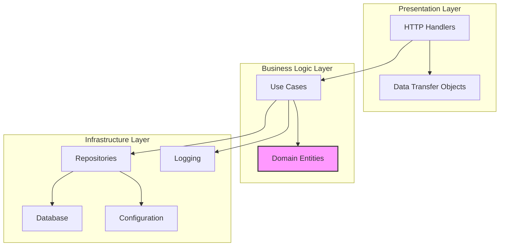
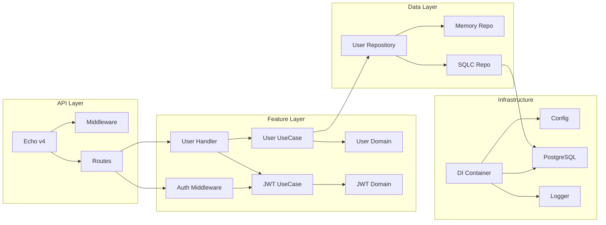
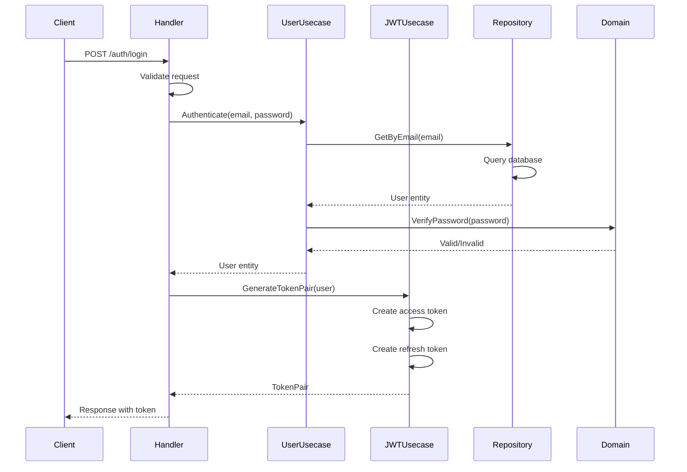
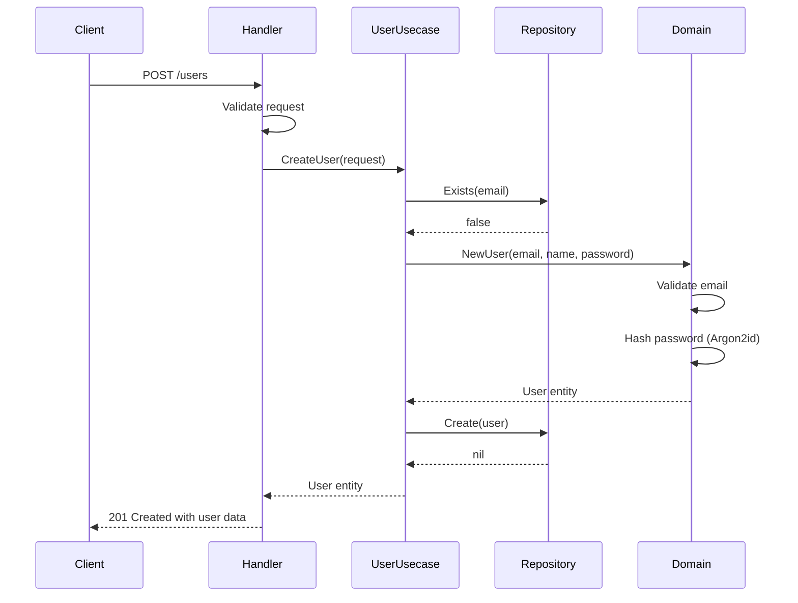

# System Architecture

**Last Updated:** 2026-02-10

## Architecture Patterns

### Clean Architecture (Hexagonal)

The project follows Clean Architecture principles with clear layer separation:



### Dependency Rule

Dependencies point inward:
- Presentation depends on Business Logic
- Business Logic depends on nothing (pure domain)
- Infrastructure implements interfaces defined in Business Logic

## Component Diagram



## Layer Responsibilities

### Presentation Layer (`handler/`)
- HTTP request/response handling
- Request validation using validator/v10
- Response formatting with standard structure
- Route registration
- Error translation to HTTP status codes

### Business Logic Layer (`usecase/`)
- Orchestration of business operations
- Domain entity coordination
- Business rule enforcement
- Error handling and logging
- Transaction coordination (when needed)

### Domain Layer (`domain/`)
- Core business entities (User, JWT claims)
- Domain-specific validation rules
- Business logic encapsulation
- No external dependencies
- Pure Go code

### Infrastructure Layer (`repository/`, `infrastructure/`)
- Data access implementations
- External service integrations
- Configuration management
- Logging infrastructure
- Database connection management

## Data Flow: User Authentication



## Data Flow: User Creation



## Integration Points

### External Integrations
- **PostgreSQL:** Primary data store via pgx v5
- **Configuration:** Viper for multi-source config
- **Logging:** Zerolog for structured logging

### Internal Integrations
- **Dependency Injection:** Container manages all dependencies
- **Middleware:** Echo middleware for cross-cutting concerns
- **SQLC:** Type-safe SQL query generation
- **Swagger:** Auto-generated API documentation

## Feature Structure

Each feature follows this structure:

```
feature/
├── domain/          # Business entities and rules
├── dto/             # Data transfer objects
├── handler/         # HTTP handlers
├── usecase/         # Business logic
└── repository/      # Data access interfaces
```

### Current Features
1. **auth** - JWT authentication and middleware
2. **user** - User CRUD operations

### Adding New Features
Follow the established pattern:
1. Define domain entities in `domain/`
2. Create repository interface in `repository/`
3. Implement usecases in `usecase/`
4. Create handlers in `handler/`
5. Define DTOs in `dto/`
6. Register routes in `main.go`

## Dependency Injection

The container uses functional options pattern:

```go
container.New(cfg,
    container.WithMemoryRepository(),  // For development
    // or
    container.WithSQLCRepository(db), // For production
)
```

Auto-selection based on database availability:
- If DB configured → SQLC repository
- If DB not configured → In-memory repository

## Error Handling Strategy

- **Domain Errors:** Defined in domain layer (e.g., `ErrInvalidEmail`)
- **App Errors:** Wrapped in `internal/errors` with HTTP mapping
- **Logging:** All errors logged with context
- **Response:** Standardized error format with code/message/details
